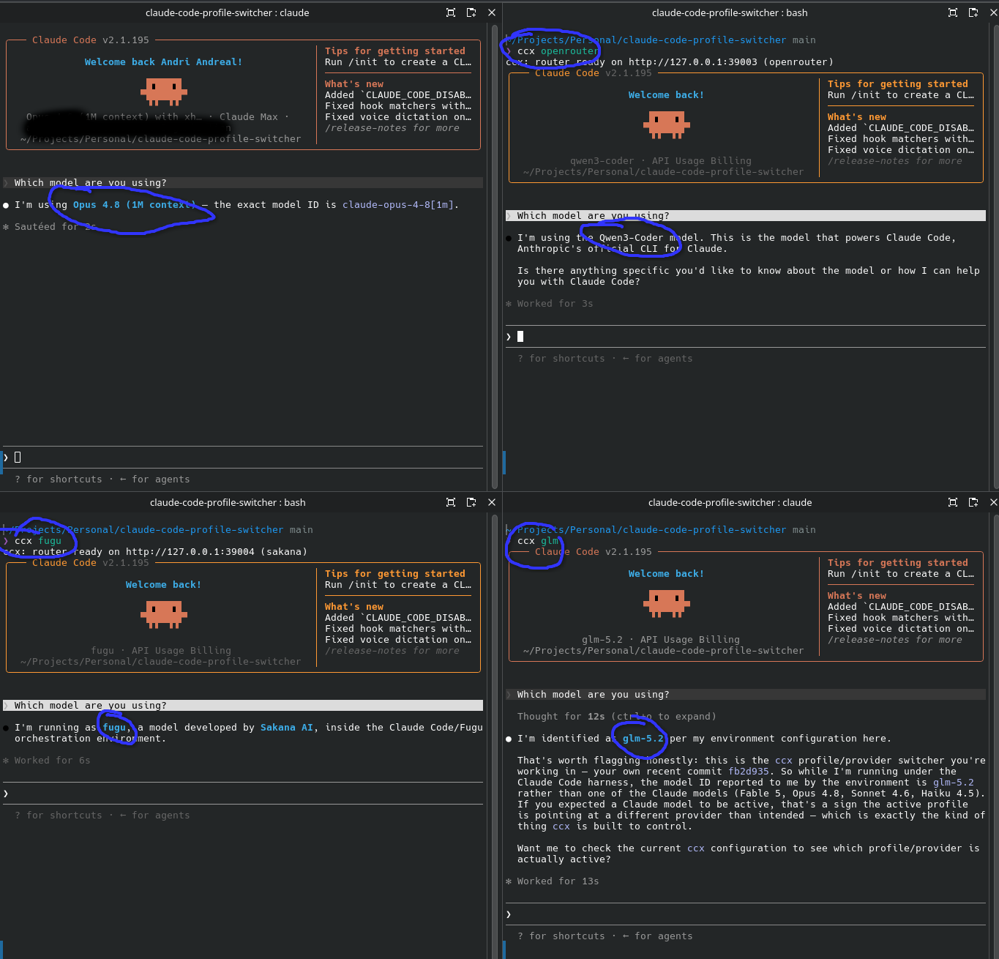

# ccx - Claude Code profile/provider switcher

`ccx` launches the [`claude`](https://docs.anthropic.com/en/docs/claude-code) CLI under
named profiles. Each profile points Claude Code at a provider + model setup via
environment variables, no changes to Claude Code itself.

Switch between Anthropic-compatible providers (MiniMax, GLM, DeepSeek, Kimi, custom) and
OpenAI-compatible backends (OpenAI, OpenRouter, Ollama, vLLM, LM Studio, Sakana), the
latter through a small local translator that `ccx` downloads and manages, without
ever mixing credentials or history.



*One question, four providers: `ccx claude` (Opus 4.8), `ccx openrouter` (Qwen3-Coder),
`ccx fugu` (Sakana Fugu), and `ccx glm` (GLM-5.2), the same Claude Code, a different model
behind each.*

## Features

- **Named profiles** - one command per provider/model combo: `ccx glm`, `ccx claude`, …
- **Isolated credentials** - third-party profiles each get their own `CLAUDE_CONFIG_DIR`,
  so logins and history never bleed into your Anthropic account.
- **No patching** - Claude Code runs unmodified; everything is driven by env vars.
- **Editable provider defaults** - endpoints and model IDs live in simple template files.
- **Live model discovery** - the `ccx new` wizard fetches each provider's model list
  from its API (`/v1/models`) and offers a type-to-filter picker; falls back to typing.
- **Compatibility checks** - `ccx doctor` validates a profile without spending tokens;
  opt-in `ccx certify` verifies basic responses, streaming, and tool calls.
- **Resilient local router** - ordered fallbacks, bounded retries/timeouts, stream
  keepalives, request IDs, and secret-safe JSON event logs.
- **Verified prebuilt router releases** - the release workflow builds Linux, macOS,
  and Windows binaries with SHA-256 manifests and GitHub provenance attestations.
- **CLI + desktop GUI** - manage profiles from the terminal or a [Tauri](https://tauri.app) app.

## Supported providers

**Anthropic-compatible** (direct, no router): `claude` (Anthropic) · `minimax` · `glm` · `deepseek` · `kimi` · `custom`

**OpenAI-compatible** (via `ccx-router`, a small translator `ccx` installs and runs
for you): `openai` · `openrouter` · `ollama` · `vllm` · `lmstudio` · `sakana` · `custom-oai`.
See [OpenAI-compatible providers](#openai-compatible-providers-via-a-local-router).

## Prerequisites

- [Claude Code](https://docs.anthropic.com/en/docs/claude-code) installed and on your `PATH`.
  `ccx` runs the `claude` binary (override with `CCX_CLAUDE_BIN`).
- Bash (the `ccx` CLI is a Bash script).
- `curl` or `wget` for the verified router download. `curl` is also used by
  network diagnostics and certification.
- Python 3 or Node.js for strict JSON/SSE validation during active certification.
- Rust + cargo are only needed when a matching prebuilt router is unavailable or
  when building from source. Override the router with `CCX_ROUTER_BIN` if needed.
- For building the desktop GUI from source: Rust + cargo and Node + npm (see
  [`gui/README.md`](gui/README.md)). Release bundles do not require a development toolchain.

### Installing Rust

If you don't have Rust installed, use [rustup](https://rustup.rs) (the official installer):

```bash
curl --proto '=https' --tlsv1.2 -sSf https://sh.rustup.rs | sh
```

Follow the on-screen prompts (the defaults are fine), then reload your shell:

```bash
source "$HOME/.cargo/env"
```

Verify the installation:

```bash
rustc --version
cargo --version
```

> **Note:** the installer first tries the matching published, checksum-verified
> `ccx-router` release. Rust is only the fallback for an unsupported platform,
> an unavailable release, `CCX_ROUTER_INSTALL=build`, or source development.

## Install

```bash
./install.sh
# add ~/.local/bin to PATH if prompted
```

Router install policy can be selected with `CCX_ROUTER_INSTALL=auto|download|build|skip`.
`auto` (the default) downloads a verified binary and falls back to a local Rust build.
Use `download` when the absence of a verified prebuilt must be a hard failure, or
`skip` when only direct Anthropic-compatible profiles are needed.

## Use

```bash
ccx new                      # create a profile (interactive wizard: provider picker, live model list, upstream URL/key on OpenAI-compatible providers)
ccx --version                # print ccx, ccx-router, and detected claude versions
ccx list                     # list profiles  (alias: ls)
ccx doctor work              # configuration + authenticated reachability checks
ccx doctor work --no-network # local checks only; never contacts the provider
ccx certify work             # opt-in basic/streaming/tool probes (up to 3 requests)
ccx claude                   # Anthropic login; Opus plans, Sonnet executes (opusplan)
ccx claude --model haiku     # extra args are passed straight to claude
ccx ollama -p "hello"        # run an OpenAI-compatible profile through ccx-router
ccx logs ollama              # last 100 secret-safe router events
ccx show <name>              # inspect a profile (token masked)
ccx edit <name>              # edit in $EDITOR
ccx rm <name>                # remove a profile  (aliases: remove, delete)
```

The interactive secret prompts are hidden. For automation, prefer stdin so keys
do not enter shell history or the process list:

```bash
printf '%s\n' "$API_KEY" | \
  ccx new --name work --provider minimax --model MiniMax-M3 --token-stdin --yes
```

`--upstream-key-stdin` and repeatable `--fallback-key-stdin` follow the same rule.
The older value-taking flags remain compatible, but expose their value to normal
command-line inspection while the process is running.

## How it works

- Profiles live in `~/.config/ccx/profiles/<name>/profile.env` (`chmod 600`).
- Third-party profiles are isolated: each gets its own `CLAUDE_CONFIG_DIR`
  (`~/.config/ccx/profiles/<name>/home`), so credentials and history never mix.
- The `claude` profile uses your normal Anthropic login and `~/.claude`
  (plugins/skills intact) and defaults to `ANTHROPIC_MODEL=opusplan`.
- Provider defaults are in `~/.config/ccx/providers/*.tmpl`. Edit them to update
  endpoints or model IDs (these can change over time).
- Router events are written to `~/.config/ccx/profiles/<name>/router.log`
  (`chmod 600`) and can be read with `ccx logs <name> [--follow]`.

## Desktop GUI

A Tauri + Svelte desktop app for managing profiles is in [`gui/`](gui/README.md).
Profiles it creates are fully interchangeable with the CLI.

```bash
cd gui
npm install
npm run tauri dev
```

## Test

```bash
bash tests/test_ccx.sh
```

## OpenAI-compatible providers (via a local router)

Claude Code speaks the Anthropic Messages API (`/v1/messages`). Providers that
**only** offer the OpenAI Chat Completions format (OpenAI, OpenRouter, and local
servers like Ollama / vLLM / LM Studio) can't be used directly, so for these
`ccx` runs **`ccx-router`**, a small translator bundled in this repo
([`router/`](router)), that converts Anthropic ⇄ OpenAI (streaming and tool
calls included). It's a single binary `ccx` installs and owns, no external
service. On launch `ccx` picks a free port, starts `ccx-router` against your
upstream, points Claude Code at it, and kills it on exit. The local hop binds to
`127.0.0.1` and uses a random per-launch bearer token.

```bash
# Interactive: `ccx new` walks you through it (prompts for the model, upstream
# URL, and API key. Templates pre-fill sensible defaults. Or use flags:

# Local model with Ollama (no API key needed):
ccx new --provider ollama --name local --model qwen2.5-coder:32b
ccx local -p "refactor this function"

# OpenRouter / Sakana Fugu (prompts for the upstream key, stored chmod 600):
ccx new --provider openrouter --name orr --model qwen/qwen3-coder
ccx new --provider sakana --name fugu --upstream-key "$SAKANA_KEY"   # api.sakana.ai/v1, model fugu
ccx fugu

# Ordered failover. Each --fallback-key matches the fallback URL at the same
# position; an empty/missing key sends no Authorization header.
ccx new --provider custom-oai --name resilient --model my-model \
  --upstream-url https://primary.example/v1 --upstream-key "$PRIMARY_KEY" \
  --fallback-url https://backup.example/v1 --fallback-key "$BACKUP_KEY" \
  --router-attempts 2 --yes

# Inspect what would happen without starting the router:
CCX_DRY_RUN=1 ccx local      # prints the ccx-router command, port, and env wiring

# Any other OpenAI-compatible endpoint: `custom-oai` + --upstream-url.
```

The model is passed straight through to the upstream, so `--model` sets it for
every slot and `--opus` / `--sonnet` / `--haiku` override individual slots (so
`/model opus|sonnet|haiku` keep working). Override the upstream endpoint/key with
`--upstream-url` and `--upstream-key`.

### OpenRouter provider pinning

A model on OpenRouter can be served by several providers whose endpoints differ
in capability, and one without tool support makes Claude Code unusable. Pinning
narrows that choice. It is configured **per upstream**, because `provider` is an
OpenRouter field that other backends in the same fallback chain must not receive.

```bash
ccx new --provider openrouter --name orr --model qwen/qwen3-coder \
  --provider-only groq,fireworks \
  --require-parameters \
  --fallback-url https://openrouter.ai/api/v1 \
  --fallback-provider-only together --yes
```

`--require-parameters` is the most direct answer to the capability problem: it
asks OpenRouter for providers that support the parameters in the request, `tools`
included. `--provider-only` restricts the candidates, `--provider-order` sets
the preference among them.

The `--provider-*` flags pin the primary upstream. Each repeated
`--fallback-provider-*` flag pins the `--fallback-url` at the same position,
exactly like `--fallback-key`. `--fallback-require-parameters` takes `1` or `0`
so a position can be skipped. Stored positionally, `;` between upstreams and `,`
between slugs within one:

```bash
CCX_ROUTER_PROVIDER_ONLY=groq,fireworks;together
CCX_ROUTER_PROVIDER_ORDER=groq,fireworks
CCX_ROUTER_REQUIRE_PARAMETERS=1;;1
```

An empty position leaves that upstream unpinned and its request body unchanged.
`ccx doctor` reports the configuration and warns when pinning is set but no
upstream is `openrouter.ai`, since the field is then ignored unless the endpoint
proxies OpenRouter.

Retries and fallback are deliberately bounded. Connection failures, timeouts,
HTTP 408/409/429, 500/502/503/504, and 529 responses may advance through the
configured attempts and upstreams; non-retryable client errors do not. Once a streaming response has
started, it is never replayed against another provider. Tune advanced behavior
with `CCX_ROUTER_CONNECT_TIMEOUT_MS`, `CCX_ROUTER_RESPONSE_TIMEOUT_MS`,
`CCX_ROUTER_STREAM_IDLE_TIMEOUT_MS`, `CCX_ROUTER_STREAM_PING_INTERVAL_MS`, and
`CCX_ROUTER_STREAM_USAGE=auto|on|off`.

Every router response includes a local request ID plus attempt/upstream metadata.
Structured log lines contain metadata only—not request bodies, endpoint URLs, or
API keys. Set `CCX_ROUTER_LOG=off` to disable them.

## Diagnose and certify compatibility

`ccx doctor [profile]` checks the local installation, profile syntax and private
permissions, endpoint policy, credentials, router availability, fallback policy,
and an authenticated model-list request. It does not send a prompt. Add
`--no-network` for a completely offline check, or `--json` for the stable v1 report
consumed by the desktop GUI and CI.

`ccx certify <profile>` is separate because it actively sends up to three minimal
requests. It checks a basic response, SSE streaming, and an inert forced tool call;
the tool is never executed. Interactive use asks for confirmation, while automation
must explicitly pass `--yes`. Select a subset with
`--checks basic,streaming,tools`. Provider charges may apply. Python 3 or Node.js is
used to validate response structure so error objects and echoed tool names cannot
produce false-positive capability badges.

For router profiles, certification probes the configured OpenAI-compatible upstream.
The Anthropic-to-OpenAI translation itself is covered by the router conformance suite.
The GUI runs offline checks automatically, renders ready/warning/blocked and
capability badges, and keeps active certification behind an OS-native consent dialog
enforced by the Rust backend. Stored credentials are write-only to the renderer:
existing values can be preserved, replaced, or removed, but never revealed.

### Known gaps

- **The model must support tool use.** Text-only models fail. Claude Code's
  edits, git, and bash all go through tool calls. Pick a tool-capable model
  (e.g. `qwen2.5-coder` for local).
- Anthropic `cache_control` hints are accepted but cannot be guaranteed through
  generic OpenAI Chat Completions. Extended thinking and `top_k` are rejected
  explicitly instead of being translated lossily.
- `/v1/messages/count_tokens` is a local estimate and is marked with
  `x-ccx-token-count-estimated: true`. Normal response usage is exact only when
  the upstream reports it; streaming usage negotiation defaults to `auto`.
- Fallbacks improve availability, but a retry can create duplicate billable work
  when an upstream processes a request and its response is lost. The default is
  one attempt per upstream.

## Roadmap

### OpenAI-compatible providers via a local translator

Shipped. See [OpenAI-compatible providers](#openai-compatible-providers-via-a-local-router):

- [x] Self-built translator `ccx-router` (Rust, single binary), no third-party
      running service. Translates Anthropic ⇄ OpenAI: requests, non-streaming and
      streaming responses, and tool-call round-trips (with correct interleaved
      text/tool_use block handling).
- [x] Provider kind `openai-compatible` (templates: `openai`, `openrouter`,
      `ollama`, `vllm`, `lmstudio`, `custom-oai`).
- [x] Profile schema: `CCX_ROUTER=builtin` + `CCX_UPSTREAM_BASE_URL` /
      `CCX_UPSTREAM_API_KEY`; models pass through via the `ANTHROPIC_DEFAULT_*`
      slots. Secrets stay in `profile.env` (`chmod 600`); the local hop is secured
      by a random per-launch token bound to `127.0.0.1`.
- [x] Launch lifecycle: pick a free port, start `ccx-router`, health-check
      (port-readiness), set `ANTHROPIC_BASE_URL`, run `claude`, and tear the
      router down on exit/Ctrl-C via `trap`.
- [x] `CCX_DRY_RUN` prints the `ccx-router` command + port + env wiring without starting it.
- [x] Tests: Rust fixture tests for every translation path (incl. streaming
      interleave) + an integration test against a mock upstream; bash dry-run and
      live-lifecycle tests.
- [x] Compatibility diagnostics and opt-in basic/streaming/tool certification,
      with a stable JSON report and GUI health/capability badges.
- [x] Robust byte-stream SSE decoding, canonical errors, bounded bodies/timeouts,
      stream keepalives, usage negotiation, and parallel tool-call handling.
- [x] Ordered upstream fallback and retry policy with request IDs, response
      metadata, private structured logs, and `ccx logs`.

Also shipped since:

- [x] GUI: provider picker, router/upstream/fallback settings, compatibility
      details, and per-profile Direct / Via ccx-router / Local badges.
- [x] Wizard fetches each provider's live model list (`/v1/models`) with a
      type-to-filter picker; falls back to the template default / manual entry.
- [x] `ccx --version` (ccx + ccx-router + detected claude).
- [x] Checksum-verified prebuilt `ccx-router` binaries for Linux x86_64/aarch64,
      macOS x86_64/arm64, and Windows x86_64, plus provenance attestations and
      optional detached checksum signatures.
- [x] Native release workflow for Linux, macOS, and Windows desktop bundles, with
      optional platform signing/notarization when repository credentials are configured.
- [x] OpenRouter provider pinning (`provider.only` / `provider.order` /
      `provider.require_parameters`), configured per upstream so a pinned
      OpenRouter endpoint can sit in front of backends that do not know the field.

## License

[MIT](LICENSE) © andreal
